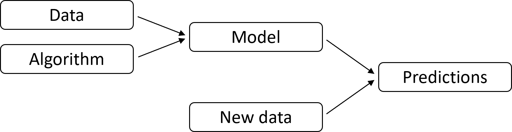

.. _getting_started:

===============
Getting started
===============

Intro to MyAutoML
-----------------

There are a lot of great open source tools for data scientists to use. Basically all data scientists know
`pandas <https://pandas.pydata.org>`__,
`numpy <https://numpy.org>`__ and
`scikit-learn <https://scikit-learn.org>`__.
Many will be familiar with tools such as
`MLflow <https://mlflow.org>`__ and
`Hyperopt <http://hyperopt.github.io/hyperopt>`__.
However, while all these packages provide great functionalities, we still have to tie them all together when we want to
build a functioning data science product. For this, many of us will be familiar with the feeling we're doing the same
things over and over again.

MyAutoML aims to fill this gap: **allowing data scientists to focus on what makes their individual projects unique.**

MyAutoML focuses on scikit-learn type data science projects of classification and regression:

What makes your project unique? Indeed, the data. The overarching process and the algorithms tend to be mostly the
same for every project. Scikit-learn and other open source packages provides the algorithms. MyAutoML aims to cover
the process tying everything together, so you as a data scientist can focus on what's most important:

- translating your business problem into an analytics problem,
- preparing the target variable and features you need,
- generating business value.

What to expect
--------------

Perhaps it is easier to start off with what not to expect. MyAutoML is not a port of AutoML as offered by the Amazons,
Googles and Microsofts of this world to your local environment. Perhaps one day in the future we may go in that
direction, but at least for now we offer you tools (functions, classes and template scripts) to automate most of the
repetitive work you do for your projects.

To get the most out of MyAutoML you will need a basic infrastructure setup, built upon open source software, such as
MLflow and Hyperopt. Please have a look at the :ref:`environment` page for more information.

Quick questions
---------------

.. raw:: html

    

    

        

            

                

                    

                        <button class="btn btn-dark btn-sm"></button>
                        How to install?
                    

                    

:ref:`install`

.. raw:: html

                    
                

            

            

                

The simplest way to install MyAutoML is to from `PyPI <https://pypi.org/project/myautoml>`_ via pip:

.. code-block:: bash

    pip install myautoml

.. raw:: html

                

            

        

        

            

                

                    

                        <button class="btn btn-dark btn-sm"></button>
                        Glossary
                    

                    

:ref:`glossary`

.. raw:: html

                    
                

            

            

                

In the User Guide we have included a :ref:`glossary`.

.. raw:: html

                

            

        

    

    

.. If you update this toctree, also update the manual toctree in the main index.rst.template

.. toctree::
    :maxdepth: 2
    :hidden:

    install
    ml_process
    environment
    train_tutorial
