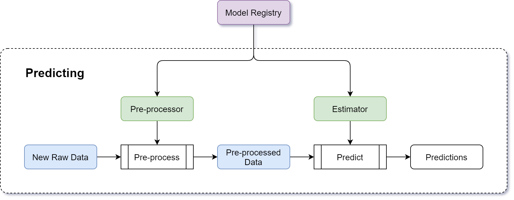

.. _ml_process:

========================
Machine Learning Process
========================

The main two processes that we aim to cover with MyAutoML are the training and predicting processes. They are two
separate processes, one for training a model and one for making predictions using a trained model. Each process is
executed by running a Python script, e.g. :code:`train.py` and :code:`predict.py`. This can be as simple or as complex
as you like: you can run the scripts manually (you can even run the code from a Jupyter notebook), or as an automated
script in a Docker container on a Kubernetes platform scheduled by Airflow.

Training
--------

The purpose of the training process is to start with some data, process it with a certain algorithm and produce a
model that captures the interesting patterns in the training data.

Predicting
----------

The goal of the prediction process is to use a (trained) model and apply it to some new data to make predictions.
A prediction script can make predictions for a batch of items, or it can spawn an API for real-time, on-demand
predictions.

Calibrating
-----------------

In some classification use cases we need to `calibrate <https://scikit-learn.org/stable/modules/calibration.html>`_
the output of our models to actual probabilities, rather than generic scores. While sometimes this can be done
directly in the training process, in other cases it is more pragmatic to train a model first, and perform the
calibration separately using the following process:

Further reading
---------------

.. raw:: html

    

    

        

            

                

                    

                        <button class="btn btn-dark btn-sm"></button>
                        Training a model
                    

                

            

            

                

`Wikipedia: Training, validation, and test sets
<https://en.wikipedia.org/wiki/Training,_validation,_and_test_sets/>`_

`Machine Learning Mastery: How to Use ROC Curves and Precision-Recall Curves for Classification in Python
<https://machinelearningmastery.com/roc-curves-and-precision-recall-curves-for-classification-in-python/>`_

.. raw:: html

                

            

        

        

            

                

                    

                        <button class="btn btn-dark btn-sm"></button>
                        Making predictions
                    

                

            

            

                

.. raw:: html

                

            

        

        

            

                

                    

                        <button class="btn btn-dark btn-sm"></button>
                        Model calibration
                    

                

            

            

                

`Machine Learning Mastery: How and When to Use a Calibrated Classification Model with scikit-learn
<https://machinelearningmastery.com/calibrated-classification-model-in-scikit-learn/>`_

.. raw:: html

                

            

        

    

    

.. toctree::
    :maxdepth: 2
    :hidden:
