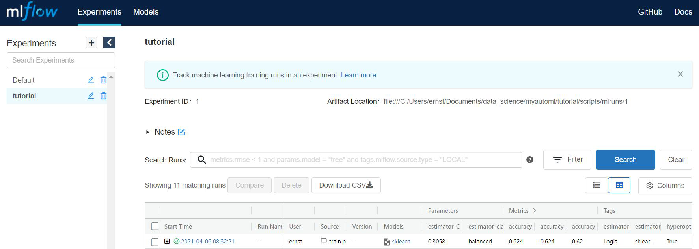
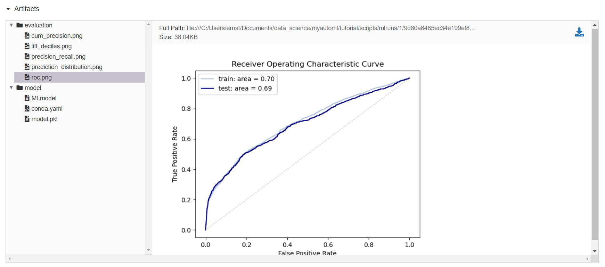

.. _tutorial:

====================================================
Tutorial: train a model
====================================================

:Author: Ernst Bolle
:Last update: 2021-05-27

Introduction
============

In this tutorial we will show you step-by-step how to train a binary classification model with the help of MyAutoML.

* :ref:`Installation`
* :ref:`Configuration`
    * :ref:`data`
    * :ref:`pre-processing`
    * :ref:`estimator & hyperparameters`
    * :ref:`config.yml`
* :ref:`Run & evaluate`
* :ref:`Wrapping up`

If you already have a local copy of MyAutoML including a working environment you may head over directly to :ref:`Configuration`.
Otherwise, start with correctly installing MyAutoML.

Installation
------------

Before we start you might wonder: what is Cookiecutter? Cookiecutter is a CLI tool that allows you to easily create a
project structure including folders, scripts and documents. It is a way to save time if you find yourself creating and
copy-pasting the same folders and scripts over time. A brief introduction can be found `on medium`_. You can
install Cookiecutter with pip.

.. _on medium: https://medium.com/worldsensing-techblog/project-templates-and-cookiecutter-6d8f99a06374#:~:text=Cookiecutter%20is%20a%20CLI%20tool,as%20well%20as%20file%20content.

.. code:: bash

   pip install cookiecutter

If you already have Cookiecutter installed make sure it is up to date since we will use the --directory option.
More information on the installation of Cookiecutter can be found `here <https://cookiecutter.readthedocs.io/en/1.7.2/installation.html>`_.
Once installed, move to the folder where you want to store MyAutoML and execute the following command.

.. code:: bash

   cookiecutter https://github.com/myautoml/myautoml.git --directory="cookiecutter/binary_classifier"

You will be prompted with a few questions regarding the project, this is a convenient feature of Cookiecutter to
customize the new project to your wishes. When finished you are ready to create a new virtual environment.

A virtual environment allows you to install and use specific versions of Python and packages specifically for one project.
This prevents cumbersome version conflicts when you run multiple projects from the same environment over time.
More information on virtual environments can be found on `real python`_.

.. _real python: https://realpython.com/python-virtual-environments-a-primer/

Move to the ``/scripts`` folder and execute the following commands from your terminal.

.. code:: bash

    conda env create -f environment.yml
    conda activate <name_of_your_environment>

Configuration
-------------

MyAutoML comes with templated Python scripts and a config file, all meant to write as little custom code as possible,
and to keep focused on what makes your project stand out: the data.

data
^^^^

For this tutorial we are going to use the `Bank Marketing Data Set <https://archive.ics.uci.edu/ml/datasets/Bank+Marketing>`_
from the UCI Machine learning repository. The official reference is:

    [Moro et al., 2014] S. Moro, P. Cortez and P. Rita. A Data-Driven Approach to Predict the Success of Bank Telemarketing.
    Decision Support Systems, Elsevier, 62:22-31, June 2014

This dataset holds a typical marketing classification task, where we are interested in predicting whether a customer
will respond to a marketing campaign yes or no. The independent variables are a mix of demographics (age), customer
specific data (balance), and behavioural data (response to previous campaigns). For demonstration purposes we
will only use 6 independent variables plus the dependent variable of the original dataset.

.. csv-table:: dataset preview
   :file: ../tables/preview.csv
   :header-rows: 1

To transform this dataset to actual training data we need to modify  ``scripts/data.py``, specifically the
``load_training_data`` function. Make sure to refer to the correct path of the dataset.

.. code:: python

    import pandas as pd
    from pathlib import Path
    from sklearn.model_selection import train_test_split

    def load_training_data():
        df_path = Path('..') / 'data' / 'bank' / 'bank-full.csv'
        df = pd.read_csv(df_path, sep=';', usecols=['age', 'default', 'balance', 'housing',
                                                    'loan', 'poutcome', 'y'])
        x = df.drop(labels='y', axis=1)
        y = df['y'].astype('category').cat.codes.astype('bool')

        x_train, x_test, y_train, y_test = train_test_split(x, y,
                                                            stratify=y,
                                                            test_size=0.2,
                                                            random_state=123)

        return x_train, y_train

Now that we have the training data, we need to shape it so it can be used for modeling.

pre-processing
^^^^^^^^^^^^^^

There are 3 pre-processing steps we need to take:

- Scale the numerical variables
- Create numeric dummy variables for the categorical variables
- Select the correct columns for each pre-processing step

It is possible to perform these pre-processing steps with custom Python functions, but we opt to choose for a scikit-learn
pipeline. There are a number of advantages of using a pipeline, such as being able to ``fit`` the transformations on
the training data, and to apply these on the test data. This is an important step in building models but easily missed.
The `official documentation`_ of MyAutoML illustrates this nicely.

.. _official documentation: https://myautoml.readthedocs.io/en/latest/getting_started/ml_process.html

.. figure:: ../images/training-process-aangepast.png
   :align: center

The pre-processor can be set in ``scripts/model.py``, where an example pipeline is already shown in the ``get_preprocessor``
function. We will overwrite the example with the following code.

.. code:: python

    def get_preprocessor():
        numeric_transformer = Pipeline(steps=[
            ('scaler', StandardScaler())])

        categorical_transformer = Pipeline(steps=[
            ('onehot', OneHotEncoder(handle_unknown='ignore'))])

        preprocessor = ColumnTransformer(transformers=[
            ('num', numeric_transformer, selector(pattern="age|balance")),
            ('cat', categorical_transformer, selector(pattern="default|housing|loan|poutcome"))]
        )

        return preprocessor

If any of this code is unfamiliar to you we can highly recommend watching these short `videos`_ on calmcode or read the
`official pipeline documentation`_.

.. _videos: https://calmcode.io/scikit-learn/pipeline.html
.. _official pipeline documentation: https://scikit-learn.org/stable/modules/generated/sklearn.pipeline.Pipeline.html

estimator & hyperparameters
^^^^^^^^^^^^^^^^^^^^^^^^^^^

To be able to build a full model pipeline, MyAutoML also uses scikit-learn for its estimators. For this tutorial we will
use logistic regression, but you can use any estimator from scikit-learn that is suited for binary classification.

To setup the estimator in ``scripts/model.py`` we need to retrieve a few things, which are all available in the
`official LogisticRegression documentation`_.

.. _official LogisticRegression documentation: https://scikit-learn.org/stable/modules/generated/sklearn.linear_model.LogisticRegression.html

- module name: sklearn.linear_model
- class name: LogisticRegression
- hyperparameters: C, class_weight

This information is used in the ``get_estimator`` and ``get_params`` functions.

.. code:: python

    from sklearn.linear_model import LogisticRegression

    def get_estimator(**params):
        estimator = LogisticRegression(**params)
        estimator_tags = {'module': 'sklearn.linear_model',
                          'class': 'LogisticRegression'}

        return estimator, estimator_tags

    def get_params():
        estimator_params = {}
        search_space = {
            'C': hp.quniform('C', 0, 1, 0.0001),
            'class_weight': hp.choice('class_weight', [None, 'balanced'])
        }

        return estimator_params, search_space

Make sure that the keys from the ``search_space`` dictionary exactly match the names of the hyperparameters. The ``hp.``
methods help to create a hyperparameter space which can be efficiently searched with ``hyperopt`` when training the model.

config.yml
^^^^^^^^^^

The last part of the configuration is to setup the config.yml file. For now we increase the max_evals to 10 and set the
shap_analysis to False. The rest of the settings will be discussed shortly, as they make more sense once we see the
first results.

.. code:: yaml

    experiment:
      name: tutorial

    model:
      name: tutorial

    training:
      max_evals: 10

    evaluation:
      primary_metric: roc_auc_cv
      metrics:
        - roc_auc
        - accuracy
      shap_analysis: False

    prediction:
      stage: Production

Run & evaluate
==============

You are now ready to run the train script. Make sure you are in the ``/scripts`` folder and that the MyAutoML environment
is activated.

.. code:: bash

    python train.py

If everything is setup correctly the script will start and you will see lots of logging statements in the terminal. Once
the training is finished we are ready to evaluate, and this is the part where MyAutoML really shines. Besides training the
model in an efficient manner with ``hyperopt``, a lot of other things were taken care of by the train script:

- Logging of the metadata of the estimator
- Logging of the metrics
- Creation of 5 typical binary classifier evaluation graphics
- Creation of the model as .pkl file, including a config file to easily distribute the model

All these things are integrated in MLflow, so you can use easily use them via the UI. If you are not familiar with MLflow,
it is an open source platform for managing the end-to-end machine learning lifecycle. Amongst other things, it keeps track
of experiments to track and compare results. More information can be found on `their website`_.

.. _their website: https://www.mlflow.org/docs/latest/index.html

To open the UI you first need to start it via a new terminal. Please move to the ``scripts`` folder, activate the MyAutoML
environment, and execute the following command.

.. code:: bash

    mlfow ui

Once you see the response in the terminal, head over to http://localhost:5000 and have a look. Note that we assume you
are running this tutorial locally.

By pressing the ``+`` button you gain access to every training evaluation (config.yml -> max_evals), which contains
valuable information:

- hyperparameter settings (complexity, balanced y/n)
- evaluation metrics (accuracy in this case, specified for cv, train, and test)
- tags (estimator class & model)

Although informative, it gets even better when you click on one of the runs. Besides ~20 evaluation metrics there is a
special section at the bottom which is called Artifacts. This section contains the graphical outputs of the specific run,
as well as the actual trained model.

There is more information available than we can describe here, so we highly recommend to take your time exploring the
experiment runs. Once finished, try to a different estimator and hyperparameter settings by adjusting the ``get_estimator``
and ``get_params`` functions. When you run the train script again the results of these new evaluations will also become
visible in the UI, so you can easily compare which estimator and hyperparameter settings work best.

Wrapping up
===========

Hopefully by now you have a better idea how MyAutoML works, and how it can help you to easily and efficiently train and
compare binary classification models. In the following tutorial we will explain the next step in the modelling phase: prediction.