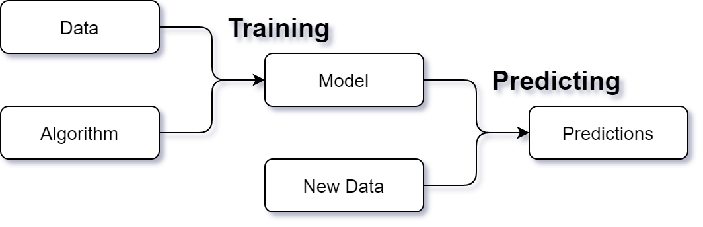

.. _glossary:

========
Glossary
========

.. _estimator:

Estimator
---------

An estimator is any object that learns from data. Most typically these are classification, regression and clustering
algorithms.

See the `Scikit-Learn estimator
<https://scikit-learn.org/stable/tutorial/statistical_inference/settings.html#estimators-objects>`_.

.. _model:

Model
-----

What exactly is a model? In MyAutoML we view a model as something that we can apply to data to make predictions.

Normally the raw data we start off with requires some preprocessing, before it can be used as input for the prediction
algorithm (see the training and predicting processes above). Therefore we view a model as a :ref:`pipeline` containing
a preprocessor and an estimator:

.. _model_registry:

Model Registry
--------------

A model registry is a tool to keep track of your models. Ideally it serves both as a log for your data science
experiments (keeping track of all the variations of models you've trained, along with key metrics indicating model
performance), and as a store for serving models to prediction processes.

:ref:`MLflow has modules supporting these functions <model-registry-mlflow>`, namely the MLflow Tracking Server and
the MLflow Model Registry respectively.

.. _pipeline:

Pipeline
--------

A pipeline is a sequence of operations to be carried out on a dataset.

See the `Scikit-Learn Pipeline
<https://scikit-learn.org/stable/modules/generated/sklearn.pipeline.Pipeline.html>`_.

.. _pre_processor:

Pre-processor
-------------

A pre-processor is any object that transforms a raw data set into a form that can be used with an :ref:`estimator`. A
pre-processor often takes the form of a :ref:`pipeline` containing multiple transformation steps.

See for example the `Scikit-Learn ColumnTransformer
<https://scikit-learn.org/stable/modules/generated/sklearn.compose.ColumnTransformer.html>`_
and the `Scikit-Learn preprocessing module
<https://scikit-learn.org/stable/modules/classes.html#module-sklearn.preprocessing>`_.

.. toctree::
    :maxdepth: 2
    :hidden:
